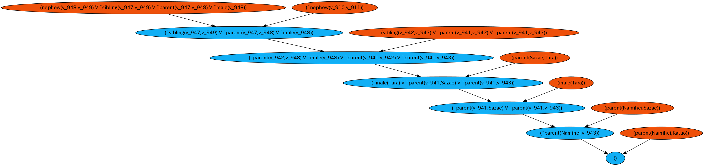

Flexpr
=====

任意の一階述語論理式(但し閉論理式で)と命題論理式を入力として導出原理で推論します.  
式の形式は論理学で一般に定義される整合論理式のままですので、  
特別なシンタックスを別途覚える必要はありません.

例
```
user@user-pc ~/flexpr $ binary/linux/REPL-linux-x64 
Flexpr Theorem Prover 1.0
Command Help
   :load <Filename>               load a definition file
   :save <Axiomatic system name>  save current system
   :desc <Axiomatic system name>  describe axiomatic system
   :set  <New axiomatic system>   change current axiomatic system
   :form <Formula>                convert it into formal form
   :add  <Formula>                add formula to current axiomatic system
   :out  <Formula>                execute resolution and outputs the proof figure
   :list  enumerate the axiomatic system that are currently defined
   :help  show this help
   :exit  exit from REPL
   :quit  alias of :exit

(NIL)>>> ((P > Q) > P) > P
resolution mode: GEN
((P > Q) > P) > P is PROVABLE under the nil
evaluation took 0 sec

(NIL)>>> :load sample/isono
isono load ok

(ISONO)>>> :desc
isono is consist of: 
parent(Namihei,Sazae)
parent(Namihei,Katuo)
parent(Namihei,Wakame)
parent(Fune,Sazae)
parent(Fune,Katuo)
parent(Fune,Wakame)
parent(Sazae,Tara)
parent(Masuo,Tara)
male(Namihei)
male(Katuo)
male(Masuo)
male(Tara)
female(Fune)
female(Sazae)
female(Wakame)
AxAy.(parent(x,y) & male(x) > father(x,y))
AxAy.(parent(x,y) & female(x) > mother(x,y))
AxAy.(parent(x,y) > ancestor(x,y))
AxAyAz.(parent(x,y) & ancestor(y,z) > ancestor(x,z))
AxAyAz.(parent(x,y) & parent(x,z) > sibling(y,z))
AxAyAz.(sibling(x,y) & parent(x,z) & male(z) > nephew(z,y))


(ISONO)>>> ExEy.sibling(x,y)
resolution mode: SLD
ExEy.sibling(x,y) is PROVABLE under the isono
specific term: Sazae Katuo 
evaluation took 0 sec

(ISONO)>>> :out ExEy.nephew(x,y)
resolution mode: SLD
ExEy.nephew(x,y) is PROVABLE under the isono
specific term: Tara Katuo 
evaluation took 0 sec
input filename: nephew.dot

(ISONO)>>> :exit
bye!
```

出力されたdotファイル(導出反駁木)をコンパイルする(graphvizが別途インストールされてる必要あり)
```
user@user-pc ~/flexpr $ dot -Tpng nephew.dot -o nephew.png
```


